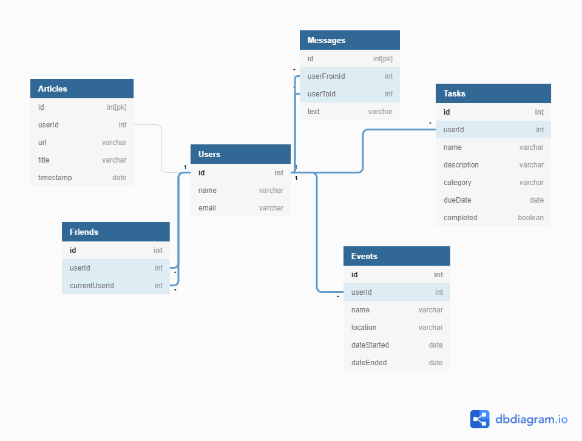
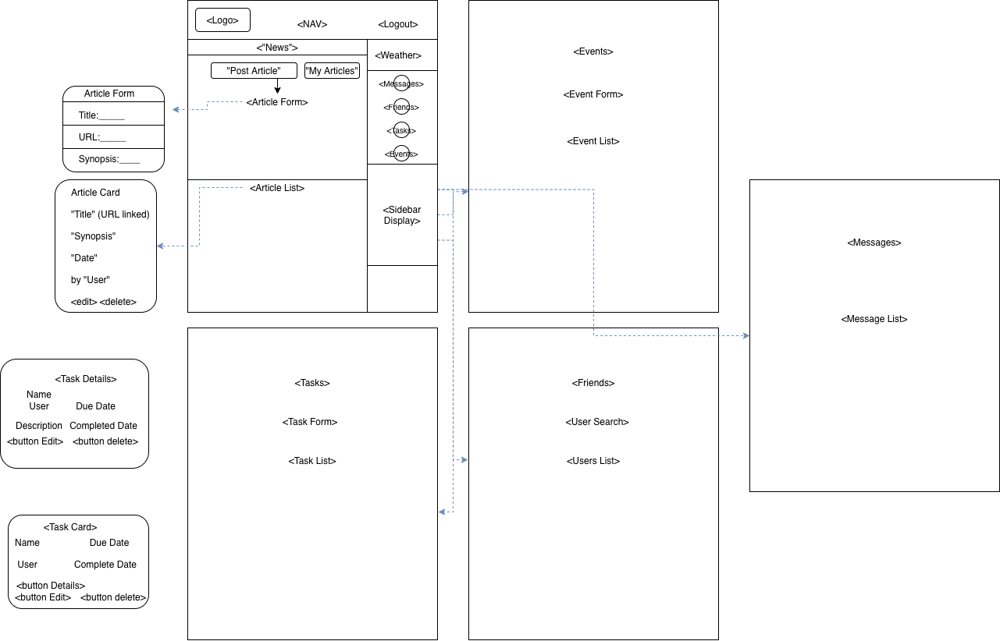

# Reactive Nutshell: The Information Dashboard

## The Vampire Brood
| [:link: Colin Miller](https://github.com/colinrmiller) | [:link: Chris Murphy](https://github.com/cwmurphy99) | [:link: Joshua Stewart](https://github.com/joshuastewart417) | [:link: Michael Wright](https://github.com/sm3dev) |
|---|---|---|---|

## How Nutshell Works in a Nutshell
* Once a user visits the homepage, they will need to login or register for an account.
#### Articles - Collection of articles to read later
* After logging in, all Articles are displayed in the main content window, and inside the navbar, today's weather is displayed.
* Any logged in User can submit a new article, and if an article was published by the logged in User, the edit and delete buttons can be clicked to perform their respective functions.
#### Friends - Interact with other users
* From the navigation menu, a user click Friends to view and edit current friends or add new Friends from the list Nutshell users. A user has has the ability to add and remove a Friend at any time they're logged in.
#### Messages - Privately message inside the App
* Another great Friends feature is the ability to private message other users.
* If a user has a message conversation started, they can access the messenger by clicking Messages in the navigation menu. Here a user can their chat history with anyone they've send/recieved a message with.
* Thanks to feedback from Nutshell users, Messages features the ability to edit or delete previously sent messages.
#### Task - The To Do list you'll totally get to
* From the nav menu, click Tasks to display a list of *to do* items that belong to the logged in user to complete each with a due date, task name, and notes. Inside the task view, a user can create a new task or edit/delete an existing task
* When a task is complete, a user can simply click the checkbox inside the task's card, and the task is removed from the task list.
#### Events - Save the dates...and address
* Events allow a logged in user to annotate and track events they're interested in attending. From the nav menu, click Events to be taken to a list of saved Events.
* Like Articles, if an event was published by the logged in User, the edit and delete buttons can be clicked to perform their respective functions.

## Entity Relationship Diagram \(ERD\)


## Wireframe, Component View 


## Setup: Follow these steps exactly

1. Clone this repository
1. `cd` into the directory it creates
1. In the `api` directory, create a copy of the `database.json.example` and remove the `.example` extension.
1. Run `json-server -p 8088 -w database.json` from the `api` directory.
1. Run `npm install` and wait for all dependencies to be installed.
1. Run `npm start` to verify that installation was successful.

> **Note:** Your `database.json` file is already in the `.gitignore` file for this project, so it will never be added to the repo or pushed to Github.

## What is Reactive Nutshell?

Nutshell is a new product offering that you have been tasked with building. It's an app for people to use to organize their daily tasks, events, news article, friends, and chat messages.

You will be using the React library to build out this application.

To start you off, here's an example of what some of the resources in your API should look like once it's populated with some data from your application.

### Users

```json
{ "id": 1, "name": "Steve Brownlee", "email": "me@me.com" }
```

### Friends

```json
{ "id": 1, "userId": 1, "currentUserId": 3 }
```

### News Articles

```json
{
    "id": 1,
    "userId": 2,
    "url": "https://www.quantamagazine.org/newfound-wormhole-allows-information-to-escape-black-holes-20171023/",
    "title": "Wormholes Allow Information to Escape Black Holes",
    "synopsis": "Check out this recent discovery about workholes",
    "timestamp": "2021-02-11T15:24"
}
```

## Professional Requirements

1. All teammates must use React and JSON-server. 
1. Each module should have a comment at the top with the following info: author(s) and purpose of module
1. The README for your project should include instructions on how another person can download and run the application
1. An ERD showing the database relationships. A screenshot/image should be included on your README.

## A Note About Authentication

We want you to know that the login and registration code we have given you is fake, completely insecure, and would never be implemented in a professional application. It is a simulation authentication using very simplistic tools, because authentication is not a learning objective of students at NSS.

You will be using [session storage](https://javascript.info/localstorage#sessionstorage) to keep track of which user has logged into Nutshell. You need to read the code in the **`Login.js`** and **`Register.js`** components so that you see what is going on, but you do not need to change it.

## Keep in mind some tips for a good usable app
1. Use acceptable conventions
   * Logo positioned at top left
   * Navigation across the top or down the left side
2. Visual hierarchy
   * Most important information is the most prominent
3. Break pages up into defined sections
   * Logically related content should be related visually
4. That which is clickable should be obviously clickable.
5. Eliminate distractions
   * Use only two typefaces
   * Limit color pallet (3 colors with black and white)
   * Use a grid
6. Support scanning (users don't read)
   * Use plenty of headings
   * Short paragraphs
   * Bulleted lists
7. Strive for consistency.
